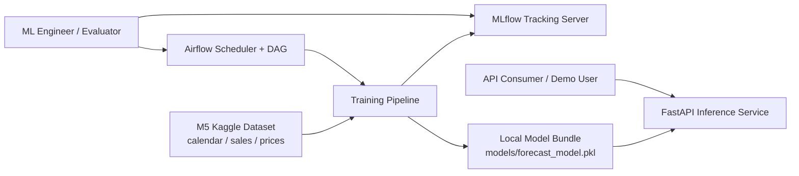
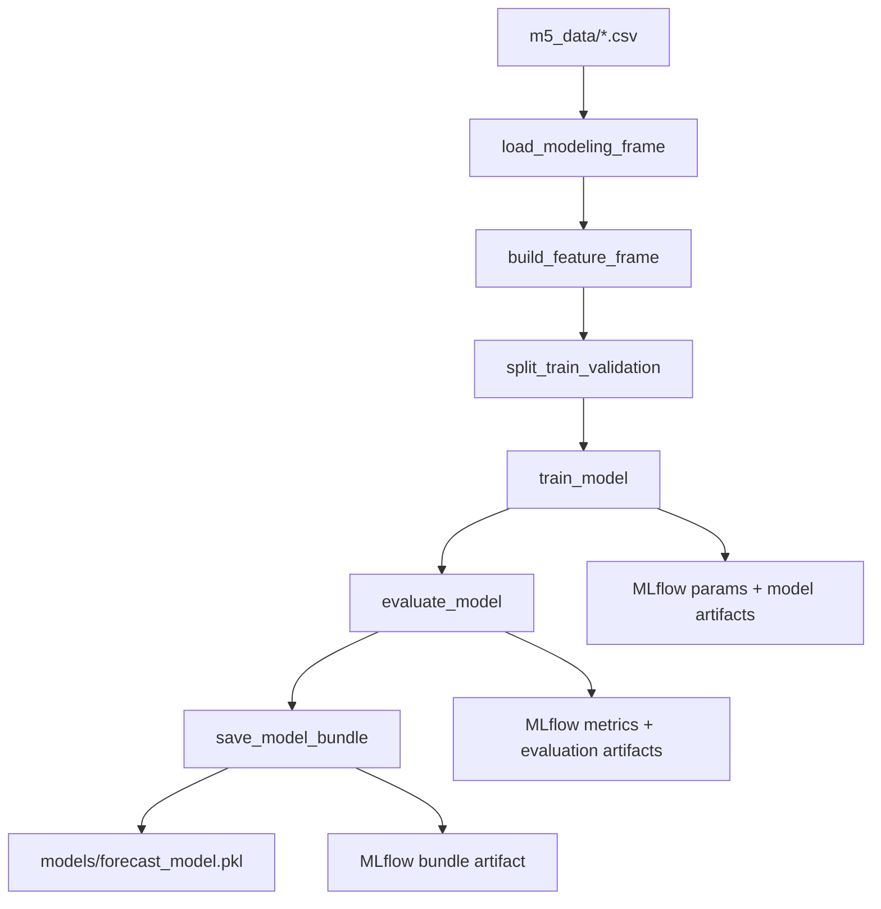
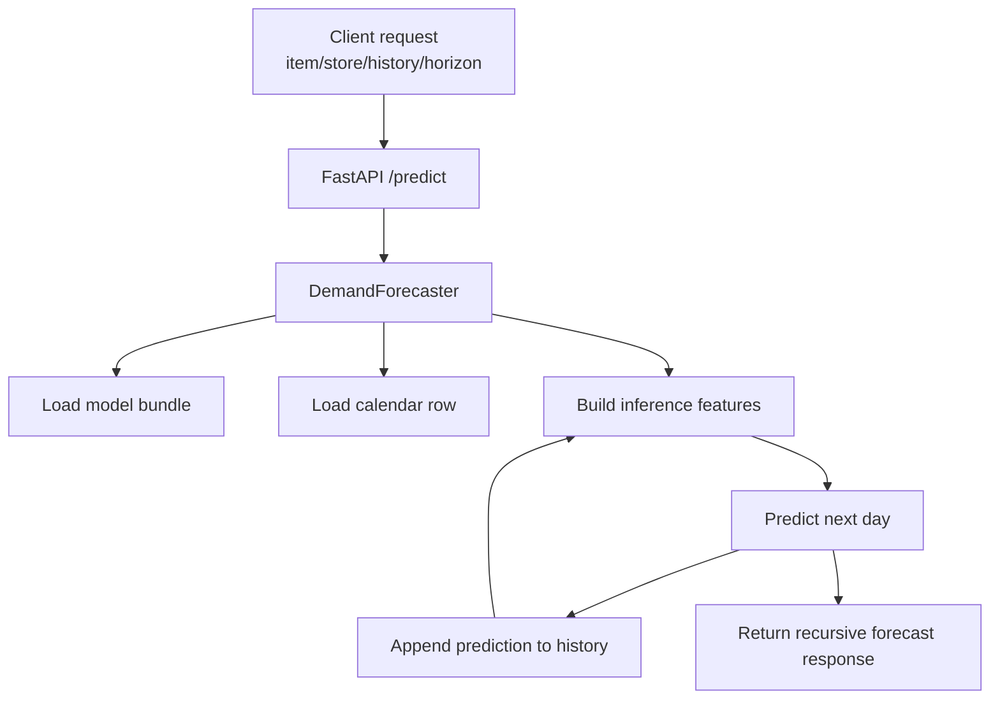

# Architecture Overview

## A. Problem Definition & Requirements

### Problem Statement and Business Context

The project addresses retail demand forecasting for the M5 Forecasting Accuracy
dataset from Kaggle, which contains historical daily unit sales, calendar
signals, and price information for Walmart products across stores in California,
Texas, and Wisconsin.

Reference dataset:

- Kaggle M5 Forecasting Accuracy:
  https://www.kaggle.com/competitions/m5-forecasting-accuracy

From a business perspective, the core problem is to estimate near-term product
demand accurately enough to support inventory planning, replenishment, and basic
operational decision-making. Poor forecasts create two costly failure modes:
stockouts, which reduce sales and customer satisfaction, and overstock, which
ties up working capital and increases storage and markdown costs.

This project is intentionally framed as an MLOps-first product rather than a
competition-winning research solution. The primary objective is to build a
clean, reproducible forecasting system that can train a baseline model, expose
predictions through an API, track experiments, and orchestrate retraining.

### User Requirements and Use Cases

Primary users:

- `ML engineer / data scientist`: train models, compare experiments, and inspect
  tracked metrics and artifacts in MLflow.
- `Platform / MLOps operator`: run scheduled retraining, monitor pipeline health,
  and verify that deployable model artifacts are produced.
- `Application consumer`: request short-horizon demand forecasts through the
  FastAPI endpoint for a specific item-store combination.
- `Instructor / evaluator`: verify that the project satisfies Lab 1 and Lab 2
  deliverables for training, serving, containerization, experiment tracking, and
  orchestration.

Main use cases:

1. A user trains a baseline forecasting model from the M5 dataset and stores a
   reproducible model artifact locally.
2. A user runs multiple experiment configurations and compares model metrics in
   MLflow.
3. A scheduler triggers retraining on a weekly basis through Airflow.
4. An API consumer submits recent demand history and receives a recursive demand
   forecast for 1 to 28 future days.
5. An operator checks model metadata, service health, and pipeline execution
   status during a demo or local development workflow.

### Success Metrics

#### Business-Level Metrics

- Lower forecasting error to improve replenishment quality and reduce stockout
  and overstock risk.
- Produce a forecasting workflow that is reproducible enough for repeated local
  retraining and demo use.
- Shorten the path from raw data to usable predictions by packaging training,
  tracking, orchestration, and serving into one system.

#### System-Level Metrics

- API service starts successfully and returns `model_loaded=true` on `/health`
  after training.
- **`GET /metrics`** exposes Prometheus-format HTTP metrics (latency histograms,
  request counters) for scraping; optionally validated via a local Prometheus
  service in Docker Compose.
- Airflow DAG completes the retraining path without manual code changes.
- MLflow stores run parameters, metrics, model artifacts, evaluation artifacts,
  and the final bundle artifact for each run.
- Dockerized services can be brought up through a documented, modular command
  sequence.
- CI (GitHub Actions) runs lint (**Ruff**), **`pip-audit`** on locked
  dependencies, and **`pytest`** on push/PR to `main`/`master`.

#### Model-Level Metrics

- `RMSE`: captures overall forecast error magnitude.
- `MAE`: provides a more interpretable absolute error measure.
- `WAPE`: reflects error relative to total demand and is useful for retail
  forecasting comparison across runs.
- `Forecast horizon support`: the deployed system must successfully generate
  recursive forecasts for 1 to 28 future days, matching the project API
  contract and the general M5-style short-horizon retail planning use case.

In this implementation, these metrics are computed on a validation split and
stored in the model bundle and MLflow artifacts.

### Scope Definition and Constraints

In scope:

- Baseline global demand forecasting using tabular features derived from M5.
- Training on sampled item-store-date rows rather than one model per SKU.
- Recursive multi-step inference up to a 28-day horizon.
- Experiment tracking with MLflow.
- Weekly retraining orchestration with Airflow.
- Local deployment via Docker Compose and FastAPI.

Out of scope:

- Competition-grade feature engineering or ensemble modeling.
- Large-scale distributed training or distributed inference.
- Enterprise authentication, authorization, and multi-tenant deployment.
- Online learning, streaming feature computation, or real-time event ingestion.
- Cloud-native production infrastructure such as Kubernetes, managed registries,
  or external object storage.

Key constraints:

- The solution is based on the Kaggle M5 dataset and assumes the CSV files are
  placed under `m5_data/`.
- The dataset is too large to commit to git, so reproducibility depends on local
  data placement and documented startup steps.
- Training is intentionally bounded through sampling and recent-day windows to
  keep local runtime practical.
- The system is optimized for local development, demos, and lab evaluation
  rather than high-throughput production traffic.

## B. System Design & Architecture

### High-Level System Architecture Diagram

### Component Design and Responsibilities

#### 1. Dataset Layer

- Raw inputs come from the M5 dataset:
  - `sales_train_validation.csv`
  - `calendar.csv`
  - `sell_prices.csv`
- The data layer provides historical demand, temporal context, SNAP indicators,
  and sell-price signals.

#### 2. Data Ingestion and Feature Engineering

- `pipeline/data_ingestion.py` reshapes the wide sales table into long format
  and joins it with calendar and price data.
- `pipeline/features.py` creates lags, rolling statistics, and the final
  modeling feature frame.
- The feature pipeline supports both training-time feature construction and
  inference-time row assembly for recursive forecasts.

#### 3. Model Training Layer

- `pipeline/training.py` builds a scikit-learn pipeline with:
  - `OrdinalEncoder` for categorical features
  - `HistGradientBoostingRegressor` as the baseline forecasting model
- The model is global: one regressor is trained across sampled item-store-date
  rows.
- Model parameters can be varied for experiment comparison.
- **Reproducibility:** `pipeline/seed.py` defines `set_global_seed()` (Python and
  NumPy). `pipeline/run_pipeline.py` invokes it before ingestion. Regressor
  `random_state` comes from `TrainingConfig.random_state`, which defaults from
  the **`RANDOM_STATE`** environment variable (see `.env.example`). MLflow logs
  `random_state` with other params.

#### 4. Evaluation and Artifact Layer

- `pipeline/evaluation.py` computes RMSE, MAE, and WAPE.
- Evaluation outputs include:
  - prediction CSV
  - metrics JSON
  - forecast visualization PNG
- `save_model_bundle()` packages the trained model, feature schema, metrics,
  configuration, and metadata into `models/forecast_model.pkl`.
- MLflow run artifacts store:
  - `model/`
  - `evaluation/`
  - `bundle/`

#### 5. Experiment Tracking Layer

- MLflow stores run metadata, hyperparameters, metrics, and artifacts.
- `experiments/run_experiments.py` executes a fixed set of baseline variations
  for comparison.
- This layer supports reproducibility and side-by-side evaluation of model
  choices.

#### 6. Orchestration Layer

- Airflow runs a weekly DAG defined in `dags/ml_training_dag.py`.
- The DAG breaks retraining into four stages:
  - `prepare_data`
  - `train_model`
  - `evaluate_model`
  - `register_model`
- This layer handles repeatable training execution and pipeline observability.

#### 7. Serving Layer

- `app/main.py` exposes the FastAPI endpoints:
  - `/health`
  - `/model/info`
  - `/predict`
  - **`/metrics`** — Prometheus exposition (HTTP request duration, counts),
    via `prometheus-fastapi-instrumentator` (hidden from OpenAPI schema).
- `app/predictor.py` loads the model bundle and `calendar.csv`, then generates
  recursive daily forecasts from recent demand history.
- Local settings load optional **`.env`** through `python-dotenv` in `create_app`
  and training entrypoints.

#### 8. Container and Runtime Layer

- `docker-compose.yml` coordinates:
  - API service
  - **Prometheus** (scrapes `http://api:8000/metrics` using
    `monitoring/prometheus.yml`)
  - MLflow tracking service
  - Airflow init
  - Airflow webserver
  - Airflow scheduler
- Docker is used to standardize runtime behavior and simplify the demo workflow.

#### 9. ML Quality & Load Testing (Optional Tooling)

- **`scripts/evidently_report.py`** — builds an HTML **data drift** report from
  two feature CSVs (reference vs current), aligned with training feature columns;
  supports `--demo` for a smoke run without M5 data.
- **`simulations/locustfile.py`** — load test `POST /predict` (requires
  `pip install locust`).
- **`simulations/benchmark_offline.py`** — measures repeated
  `DemandForecaster.predict` latency without HTTP.

#### 10. Engineering Quality Layer

- **`.pre-commit-config.yaml`** — Ruff lint and format on commit (optional local
  install: `pre-commit`).
- **`.github/workflows/ci.yml`** — install `requirements.txt`, Ruff check +
  format check, `pip-audit`, `pytest`.

### Data Flow Diagrams

#### Training and Experiment Flow

#### Inference Flow

### Technology Stack Justification

| Layer | Technology | Justification |
|---|---|---|
| Data processing | `pandas`, `numpy` | Standard tabular processing stack for reshaping M5 data and building lag/rolling features quickly. |
| Model training | `scikit-learn` | Reliable baseline ML framework, simple to package, and sufficient for a global boosted-tree regressor. |
| API serving | `FastAPI`, `Pydantic`, `Uvicorn` | Lightweight API framework with strong request validation, built-in docs, and straightforward local serving. |
| HTTP metrics | `prometheus-fastapi-instrumentator`, Prometheus | Standard RED-style visibility for latency and traffic; scrape-friendly `/metrics` for demos and ops. |
| Drift reporting | `evidently` | Off-the-shelf data drift presets and HTML reports without building custom statistical dashboards first. |
| Config | `python-dotenv`, `.env.example` | Documented env vars for paths, MLflow URI, and **`RANDOM_STATE`** without mandating a heavier config framework. |
| Experiment tracking | `MLflow` | Tracks params, metrics, models, and artifacts in a standard UI without adding major infrastructure complexity. |
| Orchestration | `Airflow` | Clear DAG-based workflow orchestration for retraining and lab-style MLOps demonstrations. |
| Visualization | `matplotlib` | Sufficient for simple validation forecast plots. |
| Containerization | `Docker`, `Docker Compose` | Reproducible multi-service local environment for API, MLflow, Airflow, and optional Prometheus. |
| Testing & CI | `pytest`, `httpx`, `ruff`, `pip-audit`, GitHub Actions | Automated style, dependency CVE scan, and regression tests on each PR. |
| Load testing (optional) | Locust (`simulations/locustfile.py`) | Python-native HTTP load generation aligned with the same `/predict` contract. |

### Trade-Offs Analysis

#### Scalability

- The global model design is simpler than training one model per item, which
  improves operational manageability.
- However, the current implementation is optimized for local-scale execution and
  limits training size through `max_series` and recent-day windows.
- Airflow and MLflow are deployed locally through Docker Compose, which is good
  for demos but not appropriate for large-scale distributed workloads.

#### Cost

- The stack is low-cost because it relies on open-source tools and local
  containers instead of managed cloud services.
- The trade-off is increased manual setup responsibility and limited resilience
  compared to hosted infrastructure.

#### Complexity

- Using scikit-learn with engineered lag features keeps the model logic easy to
  understand and debug.
- Adding MLflow and Airflow increases operational complexity, but that complexity
  is aligned with the learning objective of the project.
- The project deliberately stops short of more complex patterns such as feature
  stores, streaming pipelines, external artifact storage, or model serving
  platforms.

#### Accuracy vs. Operability

- The project does not aim to maximize leaderboard accuracy.
- Instead, it prioritizes reproducibility, observability, modularity, and a
  clean end-to-end ML product workflow.
- This is why the implementation uses a tabular boosted-tree baseline and local
  artifact storage instead of more advanced sequence models or cloud-native
  infrastructure.
- This trade-off is appropriate for a lab project whose main goal is to
  demonstrate MLOps capability rather than state-of-the-art forecasting
  performance.

## E. Responsible AI Considerations

The project now includes a baseline Responsible AI layer documented in
`RESPONSIBLE_AI.md` and generated automatically during training.

### Fairness Analysis and Bias Detection

- Validation-time fairness metrics are produced for `state_id`, `store_id`,
  `cat_id`, `dept_id`, and `item_id`.
- The report compares subgroup RMSE, MAE, and WAPE and highlights the best and
  worst subgroup by MAE together with the MAE gap.
- This does not guarantee fairness, but it provides a concrete bias-detection
  checkpoint before relying on the model operationally.

### Model Explainability

- The model explainability method is permutation importance on the validation
  split.
- This is used as the "equivalent" method in place of SHAP or LIME because it
  works directly with the deployed scikit-learn pipeline and quantifies which
  features most affect validation performance.

### Data Privacy Considerations

- The M5 dataset is aggregate retail data and does not contain customer-level
  personally identifiable information.
- Inputs are limited to product, store, state, calendar, price, and demand
  history fields.
- Even so, operational data and prediction payloads should still be retained
  conservatively and access-controlled in a real deployment.

### Ethical Implications

- Forecast errors can create unequal service outcomes across stores or product
  categories if some subgroups consistently receive worse predictions.
- Under-forecasting can increase stockouts, while over-forecasting can increase
  waste and markdown pressure.
- For that reason, the project treats the model as decision support rather than
  a fully autonomous inventory decision-maker.
