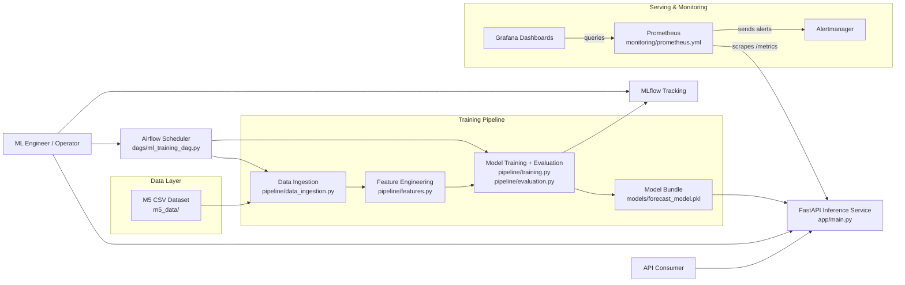
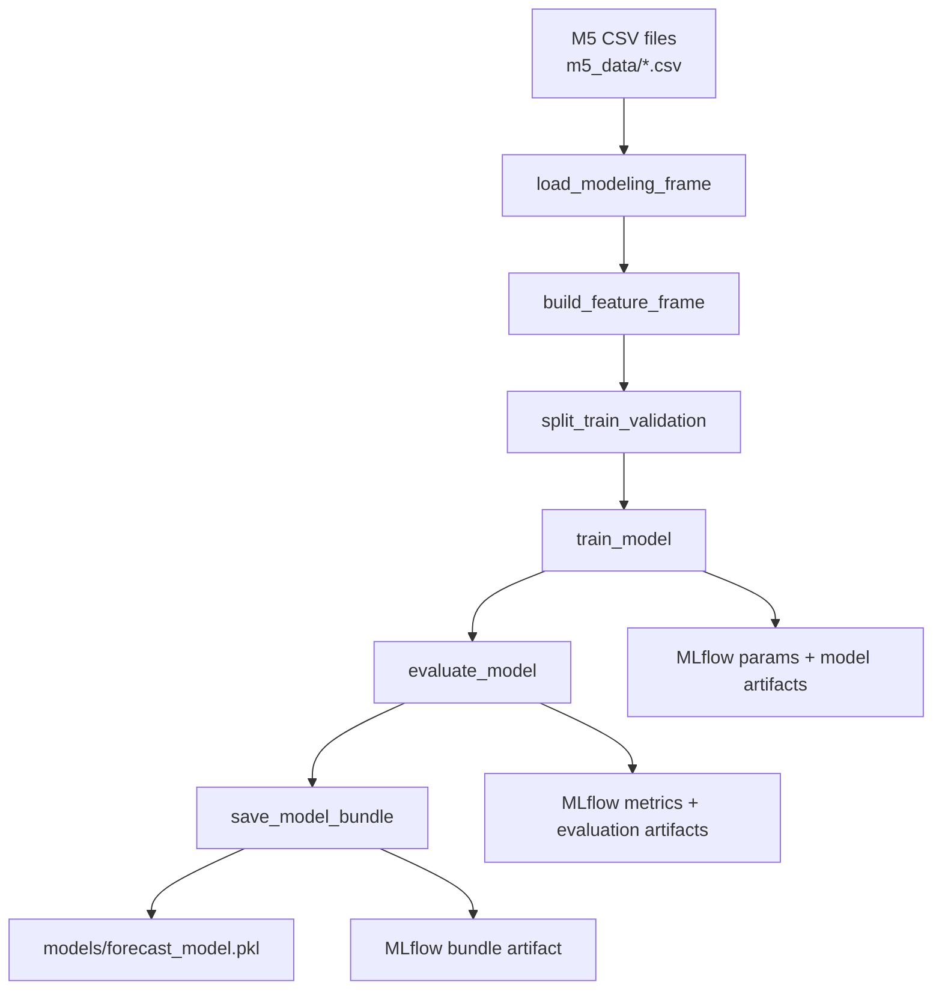
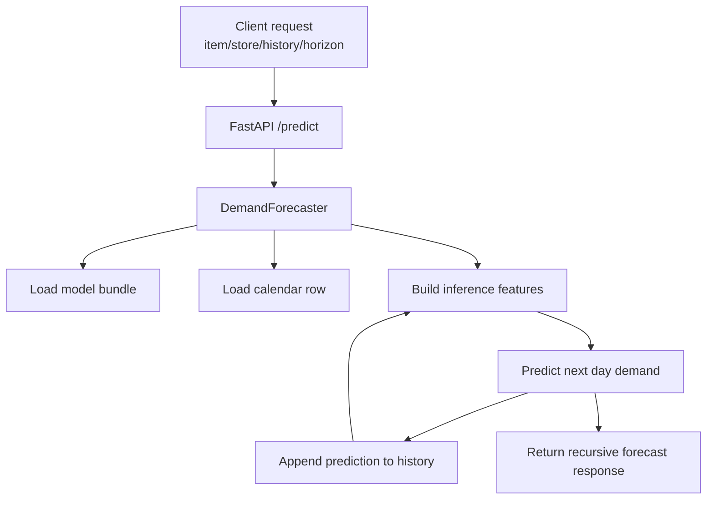
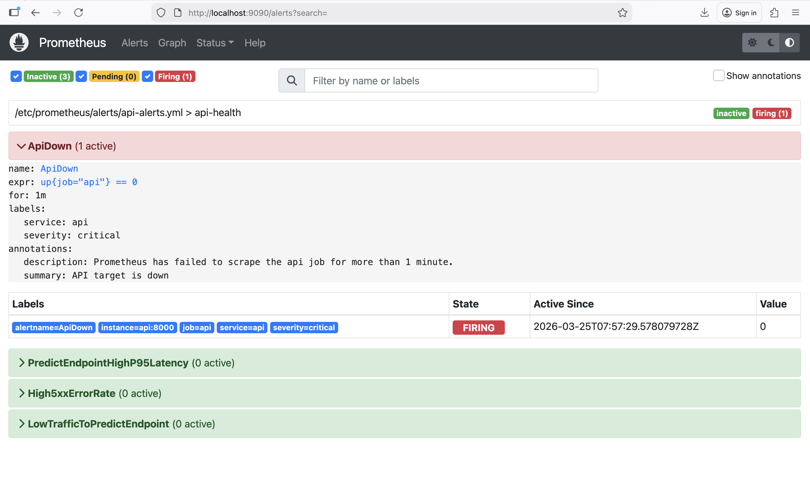
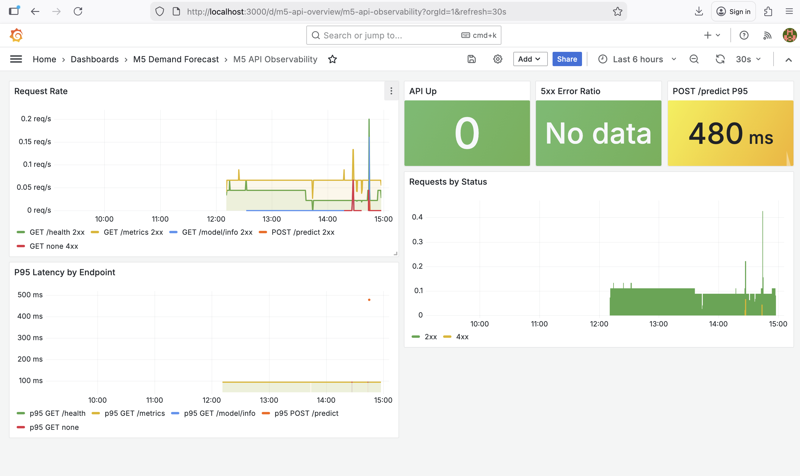
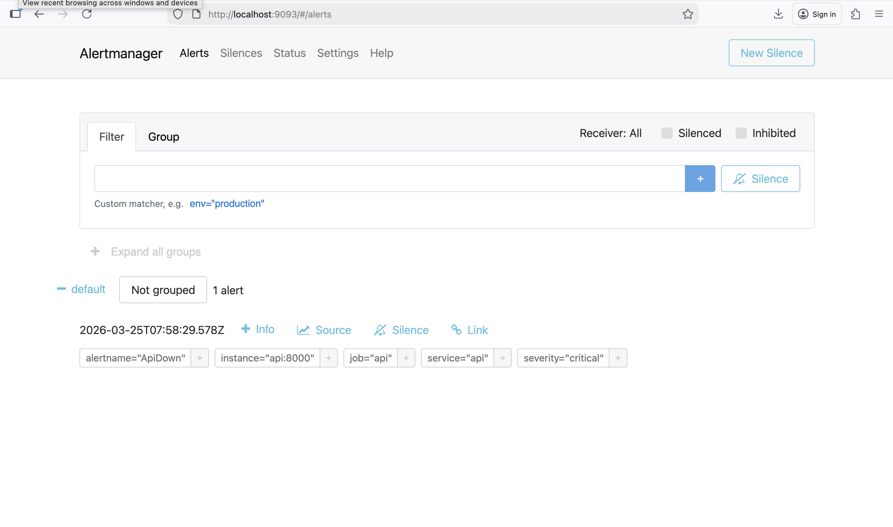

# M5 Demand Forecast

This repository implements an MLOps-first M5 demand forecasting project that
covers the main deliverables from DDM501 Lab 1 and Lab 2:

- Lab 1: train a demand model, expose it through FastAPI, dockerize it, and test it
- Lab 2: refactor training into a modular pipeline, track experiments with MLflow,
  and orchestrate retraining with Airflow

The goal is not to win the M5 competition. The goal is to build a clean,
reproducible ML product around the M5 data.

**Operational guide (training, `/metrics`, Prometheus, Evidently, Locust, CI):**
[PIPELINE_RUN.md](./PIPELINE_RUN.md) (Vietnamese). **Architecture and design
rationale:** [ARCHITECTURE.md](./ARCHITECTURE.md). **Monitoring guide:**
[MONITORING.md](./MONITORING.md)

## Project Structure

```text
.
├── app/                     # FastAPI inference service
├── pipeline/                # Training, evaluation, registry, reproducibility (seed)
├── experiments/             # Repeated MLflow experiment runs
├── dags/                    # Airflow DAGs
├── scripts/                 # Entrypoints (e.g. baseline train, Evidently report)
├── simulations/             # Locust load test, offline inference benchmark
├── monitoring/              # Prometheus, Grafana, and alerting config
├── tests/                   # Unit tests
├── models/                  # Local model artifacts (.pkl; not committed by default)
├── .github/workflows/       # CI: Ruff, pip-audit, pytest
├── Dockerfile
├── docker-compose.yml
├── .env.example             # Documented environment variables
├── .pre-commit-config.yaml  # Optional: Ruff on commit
├── requirements.txt
├── ARCHITECTURE.md
├── MONITORING.md
└── PIPELINE_RUN.md
```

## System Architecture



The system trains a baseline forecasting model from the M5 dataset, logs runs
and artifacts to MLflow, packages the deployable model into
`models/forecast_model.pkl`, and serves recursive demand forecasts through the
FastAPI API. Airflow orchestrates scheduled retraining, while Prometheus,
Grafana, and Alertmanager provide local monitoring, dashboards, and starter
alerting.

## Data Flow

### Training and Experiment Flow



### Inference Flow



## Configuration

- Copy [`.env.example`](./.env.example) to `.env` if you want local overrides.
  Training and the API load **`python-dotenv`** so variables such as
  **`RANDOM_STATE`**, `DATA_DIR`, `MODEL_PATH`, and `MLFLOW_TRACKING_URI` apply
  without exporting them manually in the shell.

## Data

The project expects the original M5 CSV files under `m5_data/`:

- `sales_train_validation.csv`
- `calendar.csv`
- `sell_prices.csv`
- `sales_train_evaluation.csv`
- `sample_submission.csv`

The raw dataset is ignored by git because several files exceed GitHub's normal
file size limit.

## Model Design

The baseline model is a single global regressor trained on sampled
`item_id + store_id + date` rows. It uses:

- static IDs: item, department, category, store, state
- calendar features: weekday, month, year, events, SNAP
- demand lags: 1, 7, 28 days
- rolling demand statistics: 7-day and 28-day windows
- optional `sell_price`

The service predicts next-day demand and can recursively forecast up to 28 days.

## Technology Stack

| Area | Tools | Role in this project |
|---|---|---|
| Data processing | `pandas`, `numpy` | Load and reshape M5 CSVs, join calendar/prices, build lag/rolling features |
| Feature engineering | `pipeline/features.py` | Constructs training features and builds inference rows (lags 1/7/28 + rolling stats) |
| Model training | `scikit-learn` (`Pipeline`, `ColumnTransformer`, `OrdinalEncoder`, `HistGradientBoostingRegressor`) | Train a global demand forecasting regressor and bundle it for inference |
| Model evaluation | `sklearn.metrics`, `matplotlib` | Compute `rmse`/`mae`/`wape` and generate validation plot artifacts |
| API serving | `FastAPI`, `Pydantic` | Provide `/health`, `/model/info`, and `/predict` endpoints with typed request/response models |
| Inference orchestration | `app/predictor.py` | Loads the saved bundle and performs recursive multi-step forecasts up to the requested horizon |
| HTTP metrics | `prometheus-fastapi-instrumentator`, Prometheus | Expose and scrape `/metrics` for latency/traffic observability |
| Experiment tracking | `MLflow` | Log params/metrics/artifacts and optionally register the best model to the registry |
| Workflow orchestration | `Airflow` | Weekly retraining DAG that runs the same pipeline stages: prepare, train, evaluate, register |
| Configuration | `python-dotenv` | Load environment variables from `.env` (e.g., `DATA_DIR`, `MODEL_DIR`, `RANDOM_STATE`, `MLFLOW_TRACKING_URI`) |
| Containerization | `Docker`, `docker-compose.yml` | Local multi-service runtime for API, MLflow, Airflow, and Prometheus |
| Testing & quality gates | `pytest`, `Ruff` | Unit tests for pipeline/features/API and lint/format checks in CI |
| Optional tooling | `evidently`, `locust` | Drift reporting and load testing for the `/predict` endpoint |

## Quick Start

1. Create and activate a virtual environment.
2. Install dependencies:

```bash
pip install -r requirements.txt
```

3. Train a baseline model artifact:

```bash
python -m scripts.train_baseline
```

4. Run the API:

```bash
uvicorn app.main:app --reload --host 0.0.0.0 --port 8000
```

5. Open Swagger:

```text
http://localhost:8000/docs
```

## API

### `GET /health`

Health check for the service and model artifact.

### `GET /model/info`

Returns model metadata, metrics, and artifact path.

### `GET /metrics`

Prometheus scrape endpoint (HTTP latency histograms and request metrics). Use
with the **`prometheus`** service in Docker Compose or any external Prometheus
that can reach the API.

### `POST /predict`

Forecast demand from a recent demand history window.

Example request:

```json
{
  "item_id": "FOODS_1_001",
  "dept_id": "FOODS_1",
  "cat_id": "FOODS",
  "store_id": "CA_1",
  "state_id": "CA",
  "forecast_start_date": "2016-04-25",
  "horizon": 7,
  "recent_demand": [0, 1, 0, 2, 1, 0, 0, 3, 2, 1, 0, 1, 2, 0, 0, 1, 1, 0, 2, 2, 1, 0, 1, 3, 1, 0, 2, 2],
  "current_price": 4.99
}
```

## Training Pipeline

Run a single training pipeline:

```bash
python -m pipeline.run_pipeline
```

Optional: fix the global seed for the run (also configurable via **`RANDOM_STATE`**
in `.env`):

```bash
python -m pipeline.run_pipeline --random-state 42
```

Run the MLflow experiment batch:

```bash
python -m experiments.run_experiments
```

Start MLflow locally:

```bash
mlflow server \
  --backend-store-uri sqlite:///mlflow.db \
  --default-artifact-root ./mlruns \
  --host 0.0.0.0 \
  --port 5001
```

MLflow UI:

```text
http://localhost:5001
```

## Airflow

The repository includes a weekly retraining DAG in
[`dags/ml_training_dag.py`](./dags/ml_training_dag.py).

Airflow UI:

```text
http://localhost:8080
```

Default credentials are set in `docker-compose.yml` for local development only.

## Docker Demo Workflow

For the lab demo, use Docker Compose in modular steps rather than one large
`docker compose up` command. Long-running services should be started with
`docker compose up`, while one-off jobs such as experiment runs and training
should be executed with `docker compose run --rm`.

Run these commands from the project root:

1. Start MLflow:

```bash
docker compose up --build -d mlflow
```

2. Initialize Airflow metadata and create the local admin user:

```bash
docker compose up --build airflow-init
```

3. Run the experiment batch and log runs to MLflow:

```bash
docker compose run --rm -e MLFLOW_TRACKING_URI=http://mlflow:5000 api python -m experiments.run_experiments
```

4. Train the final model artifact used by the API:

```bash
docker compose run --rm -e MLFLOW_TRACKING_URI=http://mlflow:5000 api python -m pipeline.run_pipeline
```

5. Start the API, monitoring stack, and Airflow services:

```bash
docker compose up -d api prometheus grafana alertmanager airflow-webserver airflow-scheduler
```

6. Verify container status:

```bash
docker compose ps
```

Useful URLs after startup:

- API docs: `http://localhost:8000/docs`
- API health: `http://localhost:8000/health`
- API metrics: `http://localhost:8000/metrics`
- Prometheus UI: `http://localhost:9090`
- Grafana UI: `http://localhost:3000`
- Alertmanager UI: `http://localhost:9093`
- MLflow UI: `http://localhost:5001`
- Airflow UI: `http://localhost:8080`
- Airflow login: `admin` / `admin`
- Grafana login: `admin` / `admin`

### Verify Monitoring Stack

Start the monitoring services and confirm they are all up:

```bash
docker compose up -d api prometheus grafana alertmanager
docker compose ps
```

In **Prometheus** (`http://localhost:9090`), check `Status -> Targets` and
confirm `api` is `UP`. Then run:

```promql
up{job="api"}
sum(rate(http_requests_total{job="api"}[5m])) by (handler, method, status)
histogram_quantile(0.95, sum by (le, handler, method) (rate(http_request_duration_seconds_bucket{job="api"}[5m])))
```

Generate traffic:

```bash
curl http://localhost:8000/health
curl http://localhost:8000/model/info
curl -X POST http://localhost:8000/predict \
  -H "Content-Type: application/json" \
  -d '{
    "item_id": "FOODS_1_001",
    "dept_id": "FOODS_1",
    "cat_id": "FOODS",
    "store_id": "CA_1",
    "state_id": "CA",
    "forecast_start_date": "2016-04-25",
    "horizon": 7,
    "recent_demand": [0,1,0,2,1,0,0,3,2,1,0,1,2,0,0,1,1,0,2,2,1,0,1,3,1,0,2,2],
    "current_price": 4.99
  }'
```

In **Grafana** (`http://localhost:3000`), sign in with `admin` / `admin`, open
`Dashboards -> M5 Demand Forecast -> M5 API Observability`, and confirm `API Up`
shows `1`, request-rate panels move, and latency panels show values for
`/health`, `/model/info`, and `/predict`. If the dashboard is missing, run
`docker compose logs grafana`.

In **Prometheus -> Alerts**, confirm these rules are loaded: `ApiDown`,
`PredictEndpointHighP95Latency`, `High5xxErrorRate`, and
`LowTrafficToPredictEndpoint`. Most should be `Inactive` in a healthy state. To
test the full alert pipeline:

```bash
docker compose stop api
docker compose start api
```

After stopping the API, `ApiDown` should go `Pending` then `Firing` in
Prometheus and appear in **Alertmanager** (`http://localhost:9093`). After
starting the API again, the alert should clear within a minute or two.

Failure-state visuals after `docker compose stop api`:

Prometheus target shows the API service as down:



Grafana dashboard reflects the API dropping from 1 to 0 services:



Alertmanager shows the `ApiDown` alert firing:



If `models/forecast_model.pkl` already exists and you only want to bring the
stack back up without rerunning experiments and training:

```bash
docker compose up -d mlflow
docker compose up airflow-init
docker compose up -d api prometheus grafana alertmanager airflow-webserver airflow-scheduler
docker compose ps
```

To stop the stack:

```bash
docker compose down
```

## Tests

```bash
.venv/bin/pytest -v
.venv/bin/pytest tests/test_features.py tests/test_pipeline.py -v
.venv/bin/pytest tests/test_api.py -v
.venv/bin/ruff check .
.venv/bin/ruff format --check .
.venv/bin/pip-audit -r requirements.txt --ignore-vuln CVE-2026-4539
```

## CI/CD (GitHub Actions)

This repository includes 3 workflows under `.github/workflows/`:

- `ci.yml`: runs on pull requests and pushes to `main`, `develop`, and `master`
  - runs on GitHub-hosted runner (`ubuntu-latest`)
  - Python 3.12, cached pip installs from `requirements.txt`
  - **Ruff** lint + format check, **`pip-audit`** on `requirements.txt`, `pip check`, then **`pytest -v`**
  - builds both Docker images (`Dockerfile` and `Dockerfile.airflow`)
- `cd.yml`: runs on pushes to `main` and `develop`, and manual dispatch
  - runs on GitHub-hosted runner (`ubuntu-latest`)
  - build and push images to GitHub Container Registry (GHCR)
  - tags both `latest` and `sha-<commit>`
  - optionally triggers staging deploy webhook when `DEPLOY_WEBHOOK_URL` secret is set
- `retrain.yml`: runs weekly and manual dispatch
  - runs on a self-hosted Windows runner with labels `self-hosted`, `Windows`, `X64`, `m5-local`
  - validates `M5_DATA_DIR`, local MLflow availability, and MLflow Python import
  - trains model with Python 3.12 and writes `pipeline_result.json`
  - fails if `run_id` is null (to ensure retrain was actually logged to MLflow)
  - checks a WAPE quality gate
  - uploads the retrained model artifact

### Pre-commit (optional)

`pip install pre-commit && pre-commit install`, then `pre-commit run --all-files`.

### Required Repository Settings

Configure the following repository secrets in GitHub:

- `DEPLOY_WEBHOOK_URL` (optional): webhook endpoint used by `cd.yml`
- `M5_DATA_DIR` (required for `retrain.yml`): absolute path to M5 CSV directory on the self-hosted runner, for example `D:\datasets\m5_data`

For retraining, `retrain.yml` uses local MLflow on the self-hosted runner:

- `MLFLOW_TRACKING_URI=http://127.0.0.1:5001`

Start MLflow on that machine before running retrain:

```bash
docker compose up -d mlflow
```

If `M5_DATA_DIR` is not set, the retraining workflow exits early without training.

`retrain.yml` also pins `setuptools==69.5.1` to ensure `pkg_resources` is available for MLflow on the runner.

### Container Images

`cd.yml` publishes:

- `ghcr.io/<owner>/m5-forecast-api:latest`
- `ghcr.io/<owner>/m5-forecast-api:sha-<commit>`
- `ghcr.io/<owner>/m5-forecast-airflow:latest`
- `ghcr.io/<owner>/m5-forecast-airflow:sha-<commit>`

## Lab Mapping

Lab 1 deliverables covered by this repo:

- trained model artifact and loading code
- FastAPI app with `/health`, `/predict`, `/model/info`, and **`/metrics`**
  (Prometheus)
- Dockerfile and Compose service
- pytest test suite
- README and Swagger docs

Lab 2 deliverables covered by this repo:

- modular pipeline under `pipeline/` (including reproducible **`RANDOM_STATE`** /
  seed helper)
- MLflow experiment tracking and model logging
- experiment runner with multiple configurations
- Airflow retraining DAG
- model registry integration helper

Additional MLOps-oriented pieces (see [PIPELINE_RUN.md](./PIPELINE_RUN.md)):

- Prometheus in Compose, Evidently drift CLI, load-test scripts, CI with
  **`pip-audit`**
